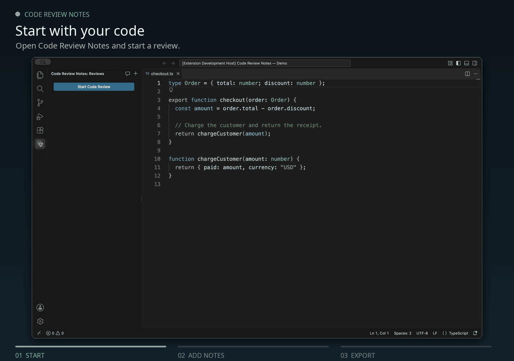

# Code Review Notebook

Ручное код-ревью в VS Code: замечания к строкам кода и локальные отчёты в Markdown и PDF.

[English](README.md)

## Пример использования

За 27 секунд показан полный сценарий в реальном расширении: создание ревью, замечание к строке кода, выбор уровня и экспорт в Markdown + PDF. В записи — учебные данные и английский интерфейс. [Статичный кадр](media/demo/preview.png).

## Как пользоваться

1. Откройте доверенную локальную папку проекта или сохранённый локальный файл в окне без папки. Перейдите на панель **Code Review Notebook**.
2. Нажмите **Начать ревью**. Название задачи, исполнитель и автор ревью обязательны. Номер задачи и ссылку на задачу можно оставить пустыми. Номер ревью по умолчанию равен 1; он должен быть целым положительным числом, не занятым другим ревью этой задачи в проекте.
3. В сохранённом файле выделите строки и вызовите **Добавить замечание** через подменю **Code Review Notebook** или палитру команд. Сочетание клавиш: `Ctrl+Alt+Shift+R`, затем `N`; на macOS — `Cmd+Alt+Shift+R`, затем `N`.
4. Выберите ревью, введите замечание, уровень и при необходимости ссылку на источник.
5. В контекстном меню ревью выберите **Завершить ревью** и формат: Markdown, PDF или оба.

Если незавершённых ревью нет, команда добавления обычного или общего замечания сначала открывает форму старта. После её сохранения открывается форма замечания. Отмена прекращает операцию.

Можно вести несколько ревью. Замечания редактируются и удаляются через контекстное меню. Нажатие открывает соответствующую строку. Команда просмотра показывает сохранённый снимок кода, даже если исходный файл удалён.

Завершённое ревью можно экспортировать повторно или скопировать данные задачи в новое ревью.

## Сохранённые имена

У полей «Исполнитель» и «Автор ревью» отдельные списки ранее сохранённых имён. При вводе список сужается: можно выбрать подходящий вариант или ввести новое имя. Подсказки доступны при создании, редактировании и копировании ревью.

Имена запоминаются после успешного сохранения формы. В списки также попадают имена из существующих ревью. После замены имени старое остаётся доступным. История хранится локально, доступна для разных проектов в одном хранилище расширения и сохраняется после перезапуска VS Code. Отмена формы не добавляет введённые имена.

## Горячие клавиши

Нажмите `Ctrl+Alt+Shift+R` (на macOS — `Cmd+Alt+Shift+R`), отпустите клавиши, затем нажмите клавишу действия. `R` в префиксе означает Review. Прежнее одиночное `Ctrl+Alt+R` / `Cmd+Alt+R` заменено, чтобы не пересекаться с командами VS Code.

| Клавиша после префикса | Команда                             | Где работает                   |
| ---------------------- | ----------------------------------- | ------------------------------ |
| `S`                    | Начать ревью (Start)                | Редактор или панель ревью      |
| `N`                    | Добавить замечание (Note)           | Редактор                       |
| `G`                    | Добавить общее замечание (General)  | Редактор или панель ревью      |
| `C`                    | Завершить ревью (Complete)          | Редактор или панель ревью      |
| `X`                    | Экспортировать отчёт (Export)       | Редактор или панель ревью      |
| `O`                    | Открыть каталог отчётов (Open)      | Редактор или панель ревью      |
| `R`                    | Редактировать ревью (Review)        | Панель ревью                   |
| `D`                    | Новое ревью этой задачи (Duplicate) | Панель ревью                   |
| `V`                    | Просмотреть замечание (View)        | Панель ревью                   |
| `E`                    | Редактировать замечание (Edit)      | Панель ревью                   |
| `Delete`               | Удалить замечание                   | Панель ревью, с подтверждением |

В панели для действий с ревью сначала выберите ревью, а для действий с замечанием — замечание. На клавиатуре Mac без отдельной клавиши удаления вперёд `Delete` соответствует `Fn+Backspace`. В редакторе должен быть открыт локальный файл; команды завершения и экспорта предлагают выбрать ревью. Сочетания не активны в терминале, полях ввода форм и других панелях. Пользовательские сочетания и другие расширения могут назначить те же клавиши: переназначить их можно в редакторе Keyboard Shortcuts по фильтру `@ext:alei1180.vscode-code-review-notes`.

## Сравнение файлов

Если открыты только файлы, новое ревью использует каталог активного файла как папку проекта. В таком окне панель может показывать ревью всех сохранённых проектов. При открытой папке список фильтруется по URI проекта.

В режиме **Выбрать для сравнения → Сравнить с выбранным** выделите строки на нужной стороне и добавьте замечание. Файл, к которому добавляется замечание, должен находиться внутри проекта выбранного ревью. Для Git-снимков команда доступна через палитру команд: контекстное меню и сочетание клавиш пока ограничены документами `file:`. Замечание сохраняет исторический код, а последующий переход к файлу открывает рабочую версию.

## Модуль и фрагмент кода

Поле **Модуль** можно редактировать. Изначально в нём указан путь к файлу. Изменённое название отображается в списке и отчёте; переход к исходному файлу сохраняется. Номера строк доступны только для чтения и берутся из выделения. При редактировании замечания сохранённый код и диапазон строк не меняются.

PDF оформлен в стиле SQM lecture-notes, адаптированном для A4: зелёная плашка заголовка, оранжевые названия замечаний, голубые ссылки и номера страниц. Текст PDF использует шрифт Computer Modern Unicode Sans без засечек с кириллицей; для кода сохраняется моноширинный FreeMono. Заголовок отчёта, названия объектов и подписи полей выделены жирным, остальные тексты имеют обычное начертание; цветная подсветка синтаксиса сохраняется. Язык берётся из редактора VS Code; для старых замечаний — из расширения исходного файла. Неизвестные языки и фрагменты длиннее 100 000 символов выводятся без подсветки. Для повторного экспорта старого отчёта после изменения оформления выберите другую папку: существующие файлы не перезаписываются.

Для замечаний без строк кода используйте **Code Review Notebook: Добавить общее замечание**. Выберите **Без привязки к файлу** или **Привязать к файлу…** из проекта ревью. Название необязательно; в отчёте у общего замечания нет номеров строк и снимка кода. Команда доступна в палитре команд, на панели ревью и в контекстном меню Code Review Notebook.

В компактной шапке рядом с количеством замечаний каждого уровня выводится его описание на языке отчёта. Заголовок замечания содержит порядковый номер и название или путь к файлу, без префикса «Модуль» и номеров строк. Перед заголовком и после него есть пустая строка в Markdown и PDF.

## Отчёты

Папка по умолчанию: `~/Code Review Note/<номер задачи>/`. Если номера нет, используется название задачи с заменой недопустимых символов.

В шапке сначала идёт название задачи, затем номер и ссылка на задачу. Пустые номер и ссылка не выводятся. Даты выводятся по местному времени в формате `2026/09/20 18:36`. В замечании к коду уровень расположен под номерами строк, затем идут необязательная ссылка на источник и подпись «Снимок кода:».

Общие замечания имеют уровень и входят в счётчики уровней. Для замечаний из версии 0.1.9 без уровня используется «Минорное». Описания уровней выводятся в скобках без точки в конце. Названия полей выделены жирным. Между номерами строк, уровнем, ссылкой на источник и подписью «Снимок кода:» нет пустых строк. Ссылка на источник расположена после уровня в одной строке с подписью, перед снимком кода; ссылка на задачу — после её номера, а если номера нет — после названия.

После экспорта только в PDF кнопка **Открыть отчёт** запускает системную программу просмотра; на Windows файл открывается через Проводник. Кнопка **Показать в папке** открывает папку с файлом. Markdown открывается в VS Code; при экспорте в оба формата первым открывается Markdown. Ошибка запуска программы просмотра не отменяет сохранение отчёта.

Последний пункт контекстного меню Code Review Notebook — **Открыть каталог отчётов**. Он открывает корневую папку отчётов из настроек в системном файловом менеджере. Если папки ещё нет, она будет создана.

## Настройки

- `codeReviewNotes.language`: `en` по умолчанию, `ru` для русского языка окон, боковой панели и сообщений.
- `codeReviewNotes.reportFormat`: `markdown`, `pdf` или `both`.
- `codeReviewNotes.reportDirectory`: по умолчанию `Code Review Note` в профиле пользователя. Внутри создаётся папка по номеру задачи, а без номера — по её названию. Относительный путь отсчитывается от профиля пользователя; можно задать абсолютный.

Смена языка обновляет открытые формы и сохраняет введённые значения. Статические команды и описания настроек используют язык самого VS Code.

Служебные подписи отчёта используют язык расширения на момент завершения. Пользовательские тексты не переводятся. Повторный экспорт сохраняет язык и номер.

Пример имени: `SHOP-142_Добавить-оплату_review-01.pdf`. В форме старта укажите «Номер ревью» (по умолчанию 1). Допускается целое положительное число, не занятое другим ревью этой задачи в проекте. Для следующего прохода свободный номер указывается вручную: форма не увеличивает значение 1 автоматически. Задача определяется по URI проекта и номеру задачи, а без номера — по названию. Для старых черновиков без указанного номера сохраняется автоматическая нумерация. При конфликте с существующим файлом другого содержания выберите другую папку отчётов.

## Хранение и ограничения

Ревью и история имён сохраняются в файле `reviews.json` локального хранилища расширения VS Code. Каждое ревью привязано к URI проекта; история имён общая для проектов в этом хранилище. Смена `codeReviewNotes.reportDirectory` меняет папку для следующих экспортов и команды «Открыть каталог отчётов». Уже созданные отчёты и база ревью не перемещаются. Для переноса черновиков нужна резервная копия хранилища; готовый отчёт не является резервной копией черновика. Перемещение проекта не переносит привязанные к нему ревью автоматически.

Поддерживается доверенный локальный режим настольного VS Code на Windows, macOS и Linux, в том числе окно с открытыми файлами без папки. В манифесте заявлен VS Code 1.96 и новее; статус проверки платформ и минимальной версии указан в [журнале проверок](docs/VALIDATION.md). Удалённые, виртуальные и браузерные рабочие пространства не поддерживаются. В workspace с несколькими папками при создании выбирается папка проекта.

Перед добавлением замечания сохраните изменения файла. Номера строк и фрагмент кода захватываются при вызове команды добавления, до открытия форм, записываются при сохранении замечания и не отслеживают последующие изменения. Одновременные изменения из другого окна не перезаписываются: форму потребуется открыть заново.

После сбоя экспорта номер сохраняется, а редактирование временно блокируется до повторного завершения. Блокировка после аварийного завершения процесса снимается примерно через 30 секунд. PDF формируется в памяти.

Расширение не отправляет код во внешние сервисы, не собирает телеметрию и не требует аккаунта. PDF создаётся автономно, со встроенным шрифтом с кириллицей.

## Установка

В панели расширений выберите **… → Установить из VSIX…** и укажите `vscode-code-review-notes-0.1.27.vsix`. Публикация в Marketplace запланирована; автоматической публикации нет.

## Разработка

Node.js 24, pnpm 11.19.0. Установка: `pnpm install --frozen-lockfile`. Проверки: `pnpm run test`, `pnpm run lint`, `pnpm run format:check`, `pnpm run test:integration`. Сборка пакета: `pnpm run package`. Отладка — F5.

Подробнее: [проведённые проверки](docs/VALIDATION.md), [архитектура](docs/ARCHITECTURE.md), [публикация](PUBLISHING.md), [поддержка](SUPPORT.md), [изменения](CHANGELOG.md).

Для обновления GIF есть [инструкция по записи и сборке](docs/DEMO.md).

## Лицензия

Лицензия MIT. Автор: Alexander Osadchy.
